# SƠ ĐỒ LUỒNG XỬ LÝ DỮ LIỆU - HỆ THỐNG E-COMMERCE

## 📊 TỔNG QUAN KIẾN TRÚC HỆ THỐNG

```
┌─────────────────────────────────────────────────────────────────────┐
│                          CLIENT (FRONTEND)                           │
│  HTML + CSS + JavaScript (Vanilla JS)                               │
│  - Trang chủ, Sản phẩm, Giỏ hàng, Thanh toán                       │
│  - Quản lý Admin Dashboard                                          │
└──────────────────┬──────────────────────────────────────────────────┘
                   │ HTTP/HTTPS Requests
                   │ (fetch API)
                   ▼
┌─────────────────────────────────────────────────────────────────────┐
│                     SERVER (BACKEND - EXPRESS.JS)                    │
│  Node.js + Express.js                                                │
│  PORT: 3000/3300                                                     │
│                                                                       │
│  ┌──────────────────────────────────────────────────────────┐      │
│  │  MIDDLEWARE LAYER                                         │      │
│  │  - CORS                                                    │      │
│  │  - Body Parser                                             │      │
│  │  - Express Session                                         │      │
│  │  - Passport.js (Google OAuth)                             │      │
│  │  - JWT Authentication                                      │      │
│  │  - Multer (File Upload)                                   │      │
│  └──────────────────────────────────────────────────────────┘      │
│                                                                       │
│  ┌──────────────────────────────────────────────────────────┐      │
│  │  ROUTES (API ENDPOINTS)                                   │      │
│  │  - /api/auth      (Xác thực & Đăng nhập)                │      │
│  │  - /api/products  (Sản phẩm)                             │      │
│  │  - /api/admin     (Quản trị)                             │      │
│  │  - /api/cart      (Giỏ hàng - client-side)              │      │
│  │  - /api/orders    (Đơn hàng - planned)                   │      │
│  └──────────────────────────────────────────────────────────┘      │
└──────────────────┬──────────────────────────────────────────────────┘
                   │ MySQL2 (Promise)
                   │ Connection Pool
                   ▼
┌─────────────────────────────────────────────────────────────────────┐
│                    DATABASE (MySQL)                                  │
│  CSDL_DoAnCN                                                         │
│  - tai_khoan (Tài khoản)                                            │
│  - san_pham (Sản phẩm)                                              │
│  - danh_muc_san_pham (Danh mục)                                     │
│  - anh_san_pham (Ảnh sản phẩm)                                      │
│  - don_hang (Đơn hàng)                                              │
│  - chi_tiet_don_hang (Chi tiết đơn hàng)                           │
│  - thanh_toan (Thanh toán)                                          │
│  - danh_gia (Đánh giá)                                              │
│  - gio_hang (Giỏ hàng - DB)                                         │
│  - lich_su_chatbot (Lịch sử chatbot)                               │
└─────────────────────────────────────────────────────────────────────┘
```

---

## 🔄 CHI TIẾT LUỒNG XỬ LÝ DỮ LIỆU

### 1️⃣ LUỒNG XÁC THỰC & ĐĂNG NHẬP (Authentication Flow)

#### A. ĐĂNG KÝ TÀI KHOẢN (với OTP Email)

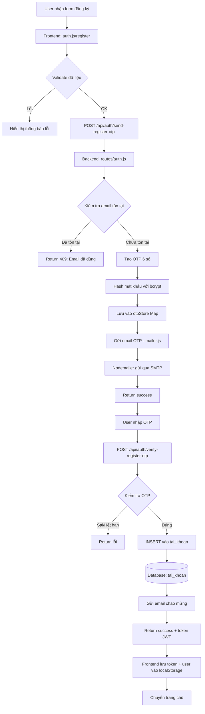

**Dữ liệu lưu trữ:**
- **otpStore (Memory)**: `{ email: { otp, expiresAt, registerData } }`
- **Database tai_khoan**: `ma_tai_khoan, ten_dang_nhap, mat_khau (hashed), email, vai_tro, trang_thai`
- **localStorage**: `token (JWT), user (JSON)`

---

#### B. ĐĂNG NHẬP THÔNG THƯỜNG

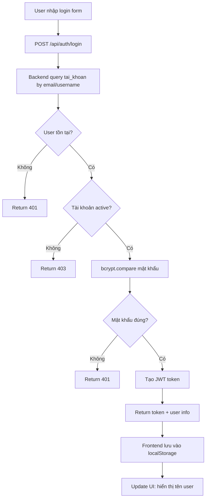

**Dữ liệu:**
- **Request**: `{ email, mat_khau }`
- **Response**: `{ success, token, user: { ma_tai_khoan, ten_dang_nhap, email, vai_tro } }`

---

#### C. ĐĂNG NHẬP GOOGLE OAUTH 2.0

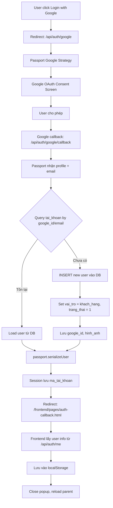

**Dữ liệu:**
- **Session**: `ma_tai_khoan`
- **tai_khoan table**: Thêm/cập nhật `google_id, hinh_anh`

---

### 2️⃣ LUỒNG SẢN PHẨM (Product Flow)

#### A. TẢI DANH SÁCH SẢN PHẨM

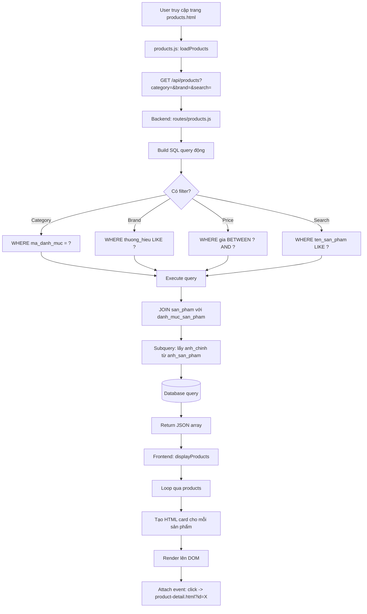

**SQL Query:**
```sql
SELECT 
    sp.ma_san_pham, sp.ten_san_pham, sp.mo_ta, sp.gia, 
    sp.so_luong, sp.thuong_hieu, sp.trang_thai,
    dm.ten_danh_muc, dm.ma_danh_muc,
    (SELECT duong_dan_anh FROM anh_san_pham 
     WHERE ma_san_pham = sp.ma_san_pham AND la_anh_chinh = 1 
     LIMIT 1) as anh_chinh
FROM san_pham sp
LEFT JOIN danh_muc_san_pham dm ON sp.ma_danh_muc = dm.ma_danh_muc
WHERE sp.trang_thai = 'hien_thi'
ORDER BY sp.ma_san_pham DESC
```

---

#### B. XEM CHI TIẾT SẢN PHẨM

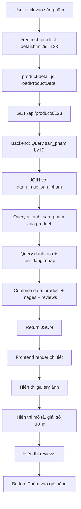

---

### 3️⃣ LUỒNG GIỎ HÀNG (Cart Flow - LocalStorage)

**⚠️ Lưu ý:** Giỏ hàng hiện tại lưu ở **localStorage** (client-side), không dùng bảng `gio_hang` trong DB.

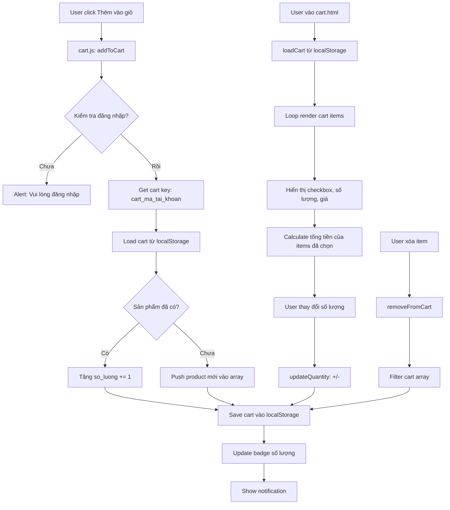

**Cấu trúc localStorage:**
```javascript
{
  "cart_5": [  // cart_{ma_tai_khoan}
    {
      "ma_san_pham": 1,
      "ten_san_pham": "Laptop Dell",
      "gia": 15000000,
      "so_luong": 2,
      "anh_chinh": "/images/products/dell.jpg"
    }
  ],
  "selected_5": [0, 1]  // Indices of selected items
}
```

---

### 4️⃣ LUỒNG ĐẶT HÀNG (Checkout Flow)

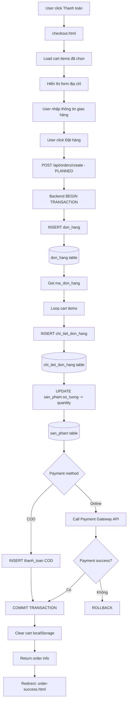

**Dữ liệu:**
- **don_hang**: `ma_don_hang, ma_tai_khoan, tong_tien, trang_thai_thanh_toan, trang_thai_don_hang, dia_chi_giao_hang`
- **chi_tiet_don_hang**: `ma_chi_tiet, ma_don_hang, ma_san_pham, so_luong, gia_ban`
- **thanh_toan**: `ma_thanh_toan, ma_don_hang, phuong_thuc, so_tien, ma_giao_dich`

---

### 5️⃣ LUỒNG QUẢN TRỊ ADMIN

#### A. ĐĂNG NHẬP ADMIN

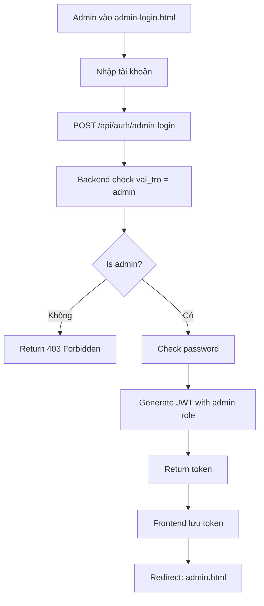

---

#### B. DASHBOARD THỐNG KÊ

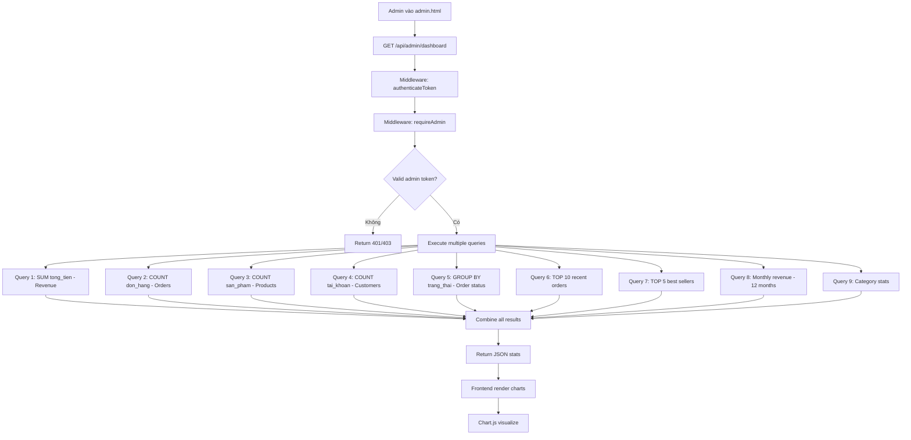

---

#### C. QUẢN LÝ SẢN PHẨM (CRUD)

**Tạo sản phẩm:**
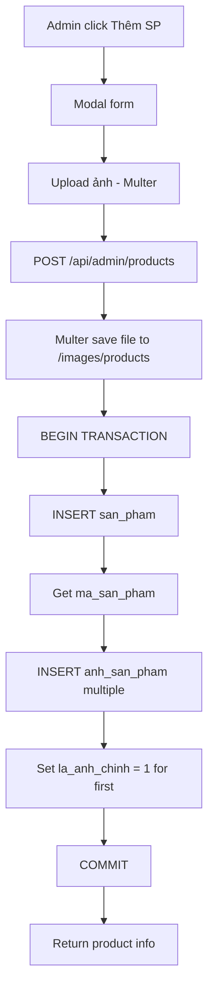

**Cập nhật sản phẩm:**
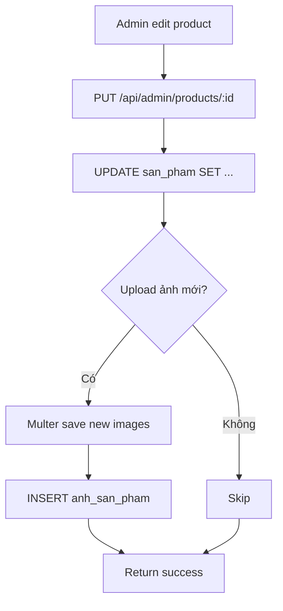

**Xóa sản phẩm:**
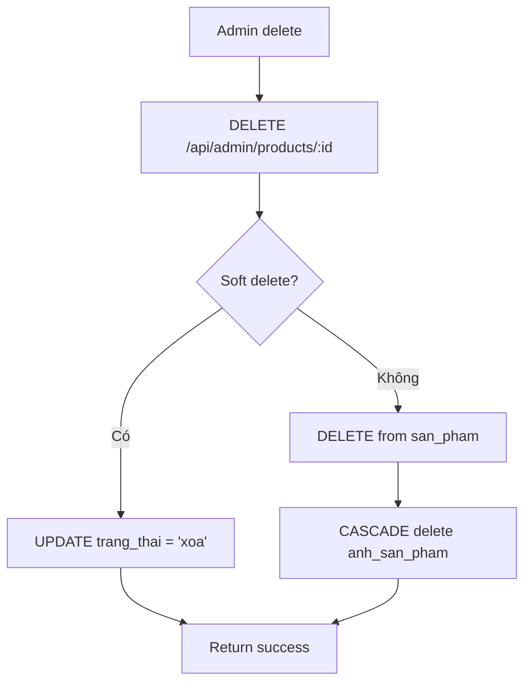

---

### 6️⃣ LUỒNG UPLOAD & QUẢN LÝ FILE

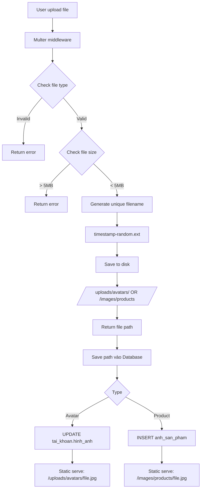

**Multer Config:**
```javascript
storage: diskStorage({
  destination: './images/products' | './uploads/avatars',
  filename: 'product-{timestamp}-{random}.jpg'
})
limits: { fileSize: 5 * 1024 * 1024 } // 5MB
fileFilter: jpeg|jpg|png|gif|webp
```

---

### 7️⃣ LUỒNG GỬI EMAIL

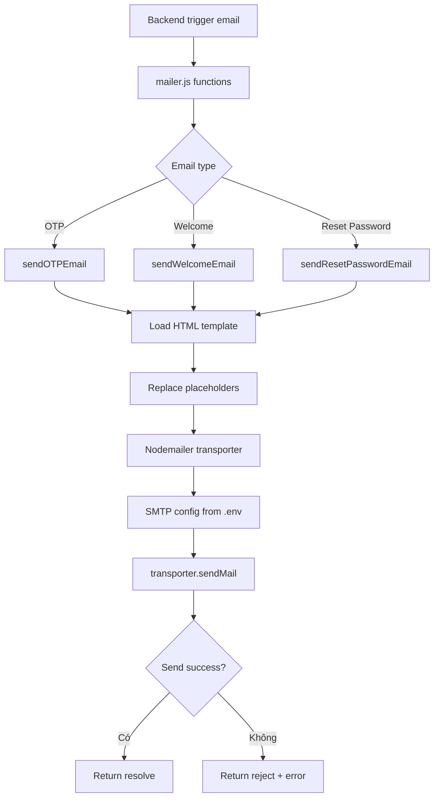

**Config:**
```javascript
{
  host: process.env.EMAIL_HOST,
  port: process.env.EMAIL_PORT,
  auth: {
    user: process.env.EMAIL_USER,
    pass: process.env.EMAIL_PASSWORD
  }
}
```

---

## 📈 SƠ ĐỒ QUAN HỆ DATABASE (ERD Simplified)

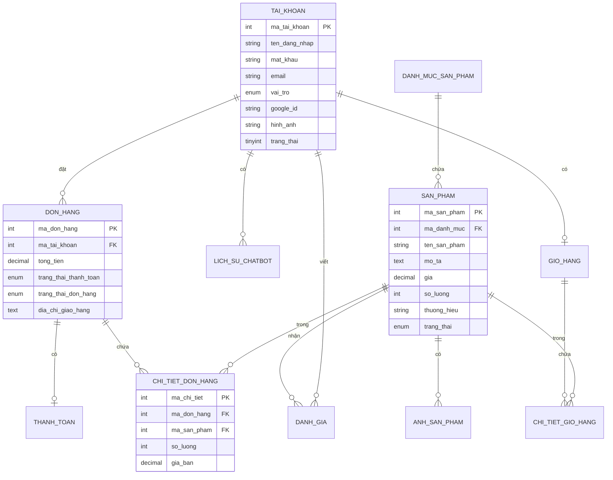

---

## 🔐 LUỒNG BẢO MẬT

### JWT Authentication Flow

```
1. Login → Server tạo JWT token
   Payload: { ma_tai_khoan, email, vai_tro, exp }
   
2. Client lưu token vào localStorage

3. Mỗi request → Header: Authorization: Bearer {token}

4. Server middleware authenticateToken:
   - jwt.verify(token, SECRET_KEY)
   - Attach user vào req.user
   
5. Admin routes → requireAdmin middleware:
   - Check req.user.vai_tro === 'admin'
```

### Password Hashing

```javascript
// Đăng ký
const hashedPassword = await bcrypt.hash(password, 10);

// Đăng nhập  
const match = await bcrypt.compare(inputPassword, hashedPassword);
```

---

## 📦 LUỒNG DỮ LIỆU QUA CÁC LAYER

```
┌─────────────────────────────────────────────────┐
│  PRESENTATION LAYER (Frontend)                  │
│  - HTML Templates                               │
│  - JavaScript Event Handlers                    │
│  - LocalStorage (cart, token, user)            │
└────────────────┬────────────────────────────────┘
                 │
                 │ fetch API (JSON)
                 ▼
┌─────────────────────────────────────────────────┐
│  APPLICATION LAYER (Backend Routes)             │
│  - Express Routes                               │
│  - Request Validation                           │
│  - Business Logic                               │
│  - Response Formatting                          │
└────────────────┬────────────────────────────────┘
                 │
                 │ SQL Queries
                 ▼
┌─────────────────────────────────────────────────┐
│  DATA ACCESS LAYER (Database)                   │
│  - MySQL Connection Pool                        │
│  - CRUD Operations                              │
│  - Transactions                                 │
│  - Foreign Key Constraints                      │
└─────────────────────────────────────────────────┘
```

---

## 🔄 CÁC LUỒNG XỬ LÝ NGOẠI LỆ (Error Handling)

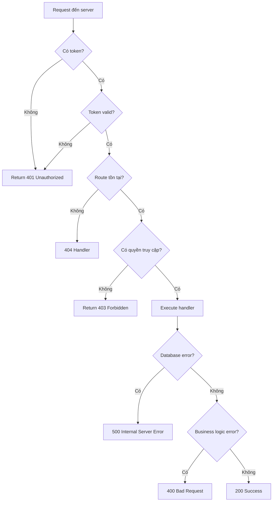

---

## 📊 TỔNG KẾT LUỒNG DỮ LIỆU CHÍNH

### 🎯 Các điểm chính:

1. **Frontend → Backend**: Sử dụng `fetch()` API với JSON format
2. **Authentication**: JWT token + Passport.js (Google OAuth)
3. **Session**: Express-session cho OAuth callback
4. **Cart**: LocalStorage (client-side) - không sync với DB
5. **File Upload**: Multer middleware → disk storage
6. **Email**: Nodemailer với SMTP
7. **Database**: MySQL với connection pooling
8. **Security**: bcrypt password hashing, JWT verification
9. **Admin**: Separate login flow + role-based access control
10. **Error Handling**: Centralized error middleware

### 🚀 Các API Endpoints chính:

**Auth:**
- `POST /api/auth/send-register-otp` - Gửi OTP
- `POST /api/auth/verify-register-otp` - Xác nhận OTP
- `POST /api/auth/login` - Đăng nhập thường
- `GET /api/auth/google` - OAuth Google
- `POST /api/auth/logout` - Đăng xuất

**Products:**
- `GET /api/products` - Danh sách sản phẩm
- `GET /api/products/:id` - Chi tiết sản phẩm
- `GET /api/products/categories/all` - Danh mục

**Admin:**
- `GET /api/admin/dashboard` - Thống kê
- `GET /api/admin/products` - Quản lý SP
- `POST /api/admin/products` - Tạo SP
- `PUT /api/admin/products/:id` - Sửa SP
- `DELETE /api/admin/products/:id` - Xóa SP
- `GET /api/admin/orders` - Quản lý đơn hàng

---

## 📁 CẤU TRÚC FILE & NHIỆM VỤ

```
backend/
├── server.js              # Entry point, khởi tạo Express
├── config/
│   ├── database.js       # MySQL connection pool
│   ├── passport.js       # Google OAuth strategy
│   └── mailer.js         # Nodemailer config & functions
├── routes/
│   ├── auth.js           # Authentication endpoints
│   ├── products.js       # Product CRUD public
│   └── admin.js          # Admin endpoints (protected)
├── images/products/      # Static product images
└── uploads/avatars/      # User avatars

frontend/
├── index.html            # Homepage
├── js/
│   ├── auth.js           # Login/logout logic
│   ├── products.js       # Product listing & filter
│   ├── product-detail.js # Single product view
│   ├── cart.js           # Cart management (localStorage)
│   └── main.js           # Global utilities
└── pages/
    ├── login.html
    ├── register.html
    ├── products.html
    ├── product-detail.html
    ├── cart.html
    ├── checkout.html
    ├── admin-login.html
    └── admin.html
```

---

**💡 Lưu ý quan trọng:**

- Giỏ hàng hiện tại lưu ở **localStorage**, chưa dùng bảng `gio_hang` trong DB
- OTP lưu tạm ở **Memory Map**, production nên dùng Redis
- Đơn hàng chưa có route hoàn chỉnh (planned)
- Session chỉ dùng cho OAuth, không dùng cho auth thường (dùng JWT)
- Static files serve trực tiếp từ Express

